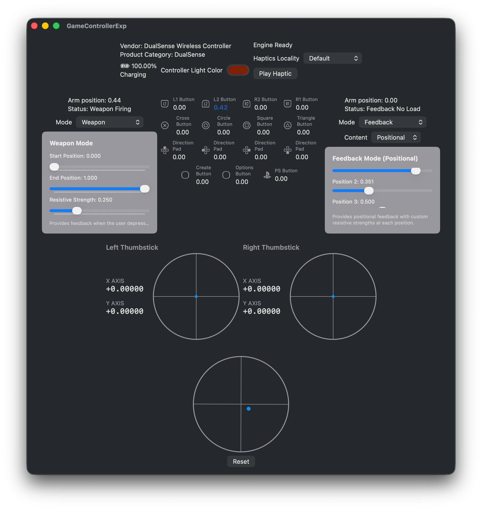
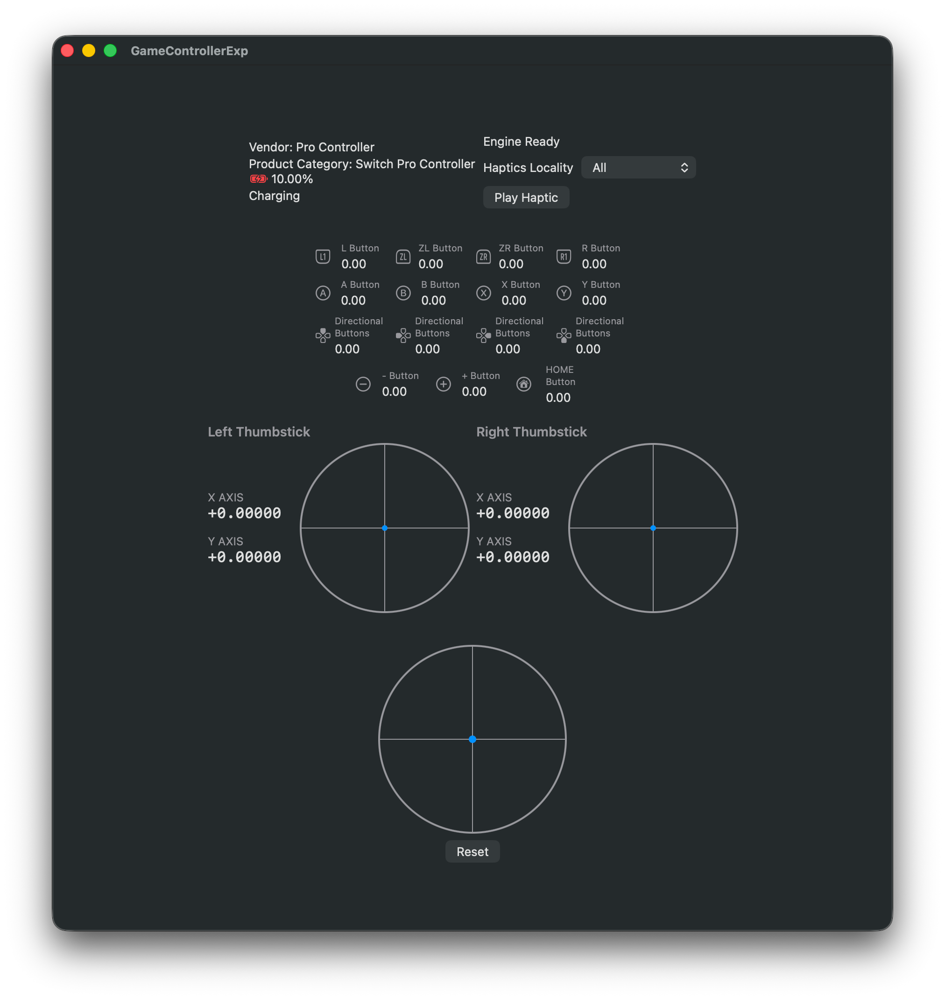
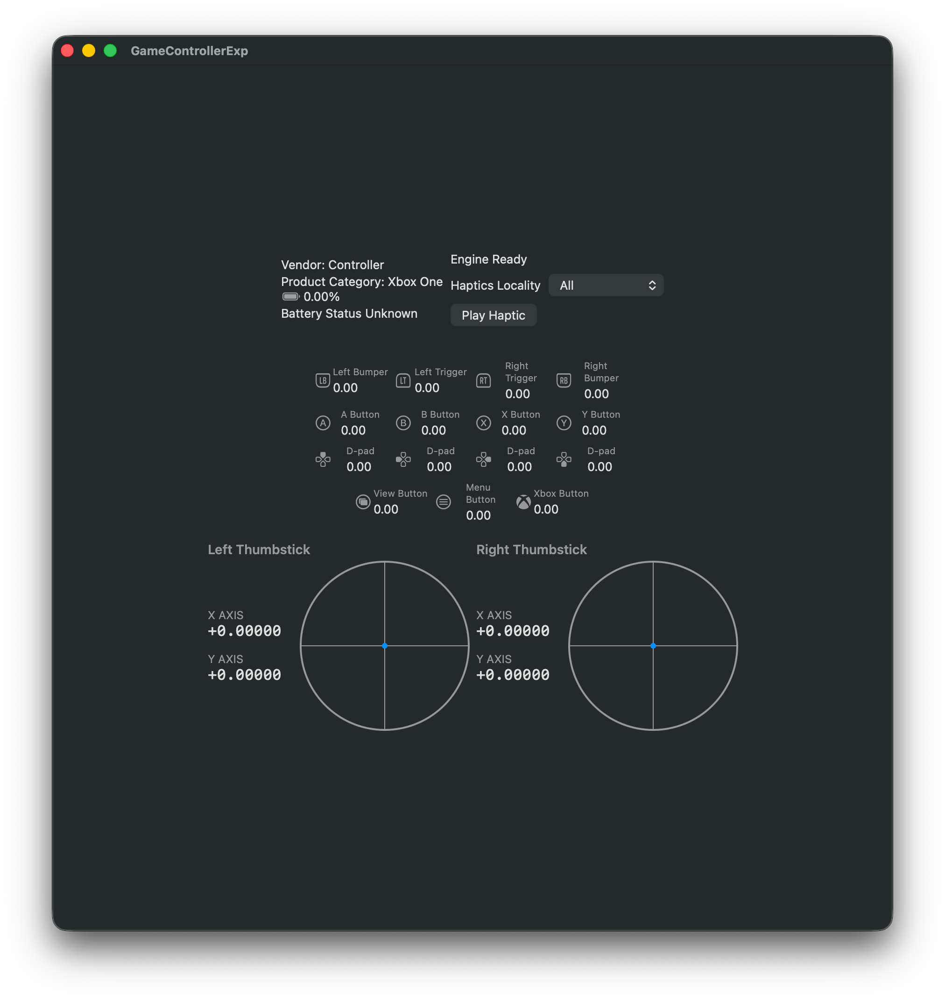

# GameControllerExp

This is a macOS gamepad/controller debug utility. It shows you button/trigger activation and their values in read-time, and motion/gyroscope sensor. For PlayStation DualSense controllers, it provides additional adaptive trigger control.

|              DualSense               |            Switch Pro             |            Xbox One             |
| :----------------------------------: | :-------------------------------: | :-----------------------------: |
|  |  |  |


## Features

### Controller Monitoring
- **Automatic Controller Detection** - Detects and connects to game controllers automatically
- **Real-Time Input Display** - Live monitoring of all controller elements:
  - Buttons (pressed/released states)
  - Analog triggers with precise values
  - Analog sticks with visual representation
  - D-pad directions
- **Motion Sensing** - Gyroscope and accelerometer data with 3D orientation tracking
- **Visual Feedback** - Circular visualizations for analog sticks and motion orientation

### DualSense Adaptive Triggers

Full control over all PlayStation DualSense adaptive trigger modes:

- **Off Mode** - Disables adaptive effects
- **Feedback Mode** - Simple and positional resistive feedback with customizable strength
- **Weapon Mode** - Simulates weapon-like trigger behavior with start/end positions
- **Vibration Mode** - Simple and positional vibration effects with amplitude and frequency control
- **Slope Feedback Mode** - Progressive resistance curves with customizable strength profiles

Each mode provides:
- Real-time arm position tracking
- Trigger status monitoring
- Precise parameter adjustment via sliders
- Live preview of trigger effects

## Requirements

- **macOS**: 15.0 (Sequoia) or later
- **Xcode**: 15.0 or later
- **Hardware**: Mac with USB or Bluetooth capability
- **Controller**: Any GameController framework-compatible controller

## Usage

1. **Connect a Controller**
   - Connect your game controller via USB or Bluetooth
   - The app will automatically detect available controllers

2. **Select Controller**
   - Use the picker to select your controller from the list
   - The debug view will appear once connected

3. **Monitor Inputs**
   - All button presses, trigger values, and stick positions are displayed in real-time
   - Motion data shows 3D orientation (pitch, yaw, roll)

4. **Configure Adaptive Triggers** (DualSense only)
   - Navigate to the adaptive trigger control section
   - Select a trigger mode from the picker
   - Adjust parameters using the sliders
   - Effects are applied immediately to the controller

## Project Structure

```
ControllerExpApp/
├── GameControllerExp/
│   └── GameControllerExp/
│       └── SwiftUI/
│           ├── GameControllerExpApp.swift      # App entry point
│           ├── GameControllerManager.swift     # State management & controller logic
│           ├── Navigations/                    # Navigation views
│           │   ├── ContentView.swift           # Main router
│           │   ├── GameControllerSelectView.swift  # Controller selection
│           │   └── GameControllerNoState.swift # Loading state
│           ├── GameController/                 # Controller-specific views
│           │   ├── GameControllerDebugView.swift           # Main debug interface
│           │   ├── GameControllerBasicInfo.swift           # Basic controller info
│           │   ├── GameControllerHaptics.swift             # Haptics control
│           │   ├── DualSenseAdaptiveTriggerControl.swift   # Adaptive trigger UI
│           │   ├── AnalogStickView.swift                   # Stick visualization
│           │   ├── GameControllerDirection.swift           # Motion visualization
│           │   └── ControllerElementCell.swift             # Reusable element display
│           └── Assets/
│               └── Assets.xcassets             # App assets
├── GameControllerExp.xcodeproj/                # Xcode project
├── Images/                                     # Documentation images
│   ├── dualsense.png
│   ├── switch.png
│   └── xbox.png
├── .gitignore                                  # Git ignore rules
├── .swiftformat.conf                           # SwiftFormat configuration
├── .swiftlint.yml                              # SwiftLint configuration
└── README.md                                   # This file
```

